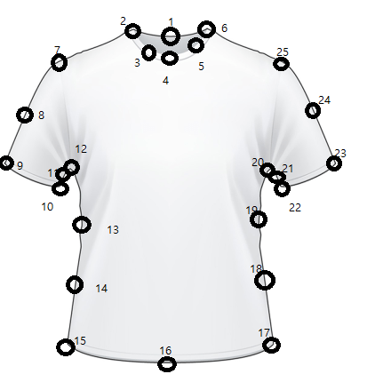
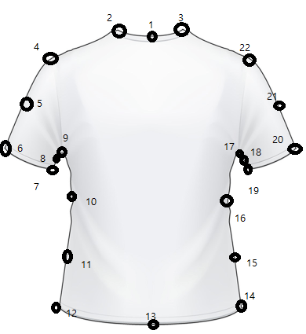

# path 설정
이미지들: ./img/groupname/######.jpg (e.g., ./img/tshirt/000001.jpg)
아웃풋: ./Output/groupname/######.jpg (e.g., ./Output/tshirt/000001.json)

# img 다운로드
드라이브에서 알집파일 다운로드

# 키
(이미지 화면에서)
1. 마우스 클릭: 랜드마크를 차례대로 클릭 (티 앞면: front.png, 티 뒷면: back.png 참고)
2. f: 티 앞면 랜드마크를 모두 선택하였을 경우
3. b: 티 뒷면 랜드마크를 모두 선택하였을 경우
4. c: 티 사진이 적절하지 않은 경우 (가려져 있거나, 티가 2개 이상이거나, 카라티셔츠이거나, 긴팔티셔츠이거나, 등등)
5: d: 레이블링을 그만하려는 경우 (나중에 이어서 할 수 있음)

